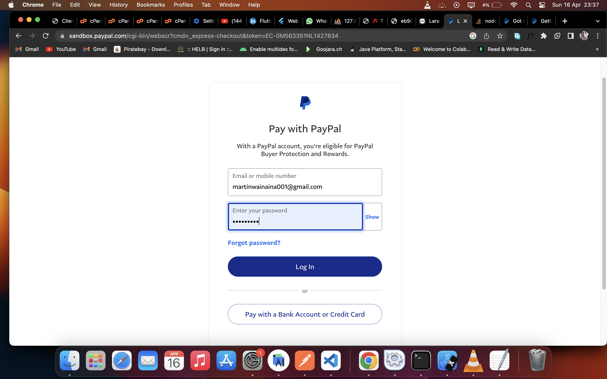

## Paypal payment integration
- [Documentation link] (https://techsolutionstuff.com/post/how-to-integrate-paypal-payment-gateway-in-laravel-8)
- Run the following command in your project to get the latest version of the paypal API package using composer.
```
composer require paypal/rest-api-sdk-php
```

- create controller
```
php artisan make:controller PaypalController
```

# To NB TO SOLVE THE FOLLOWING ERROR:
```
sizeof(): Argument #1 ($value) must be of type Countable|array, string given
```
- The solution is in following link : https://stackoverflow.com/questions/54087631/paypal-sizeof-parameter-must-be-an-array-or-an-object-that-implements-countab
<br>
Use the following change. <br>
Change File: vendor\paypal\rest-api-sdk-php\lib\PayPal\Common\PayPalModel.php:
```
} else if (sizeof($v) <= 0 && is_array($v) ) {
```
<br>
to
<br>
```
} else if (is_array($v) && sizeof($v) <= 0) {
```

## Sample Images:
- 
- 
- 
- 

